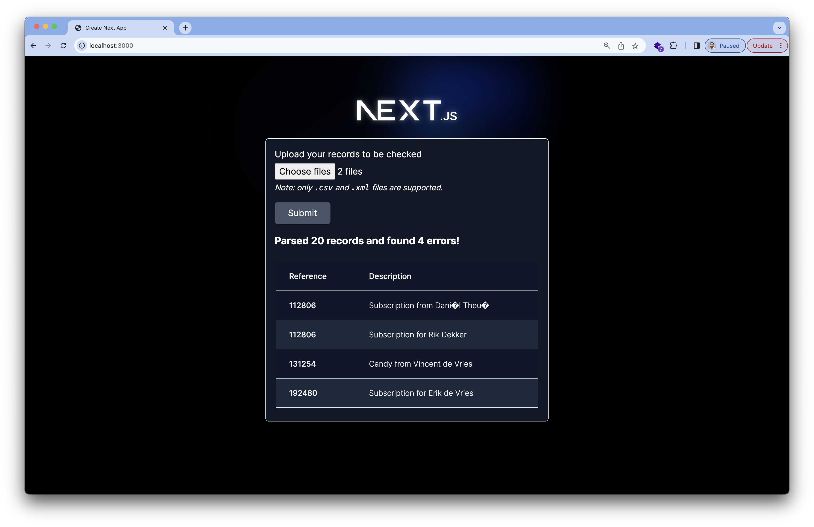

# Customer Statement Processor

Customer Statement Processor is a Next.js application built using the new Next.js `app/` router. This project served as an experiment for me to compare it to the traditional `pages/` router. I also took the opportunity to try out Vitest for unit tests and Playwright for end-to-end tests.

It utilizes both client and server components, and it has the currently still experimental server actions enabled.

The project contains some sample files in `src/tests/fixtures` with records in CSV and XML formats. These files can be uploaded in the front-end and are then parsed and validated on the server. If any errors are identified, then the records with errors are displayed in a HTML report in the front-end.

## Record parsing and validation

All code regarding record processing (parsing and validation) can be found in `src/record-parsing`.

The `xml2js` library helps with turning XML into JavaScript objects. The `csv-parser` library helps with turning CSV data into JavaScript objects.

`zod` is being used to do runtime validation of various shapes of data, such as the data being sent from the client to the server, and the contents of the processed XML and CSV files.

Because JavaScript is not typically the right tool to handle accurate money calculations, the library `big.js` is used to do precision decimal number comparisons.

## Running the project

The project was built using Node.js version 19.9.0. If you have trouble with any of these steps, please try again with that version of Node.js.

First, install the dependencies:

```bash
npm install
```

Them, run the development server:

```bash
npm run dev
# or
yarn dev
# or
pnpm dev
```

Open [http://localhost:3000](http://localhost:3000) with your browser to see the result.

You can start editing the page by modifying `app/page.tsx`. The page auto-updates as you edit the file.

## Tests

### Unit tests

The project has tests in the `src/tests` directory.

To run the tests, run:

```bash
npm test
```

### End-to-end tests

To run the tests in headless mode, run:

```bash
npm run e2e
```

And to open the browser for the end-to-end tests, run:

```bash
npm run e2e:ui
```
